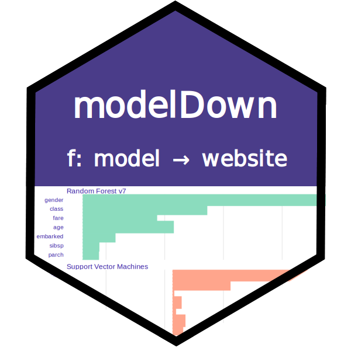
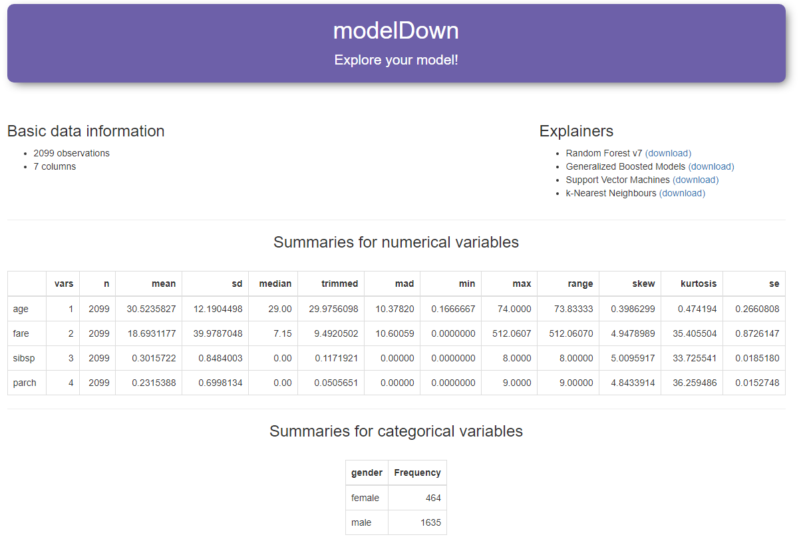
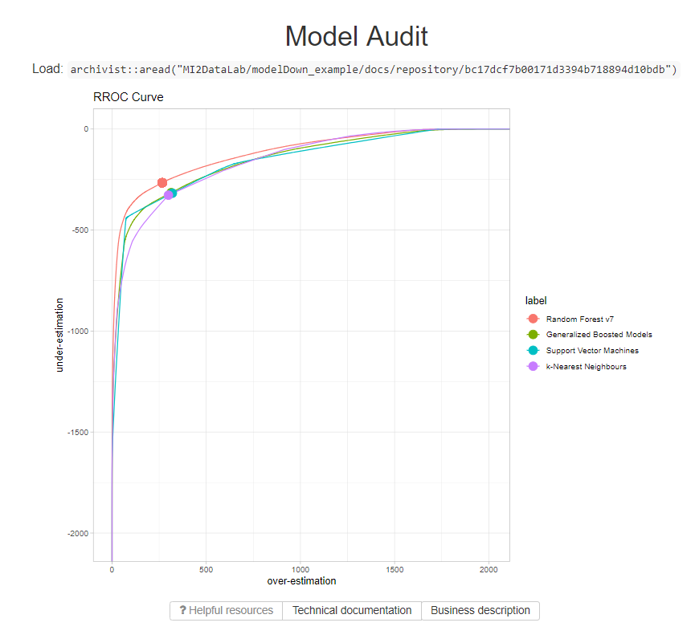
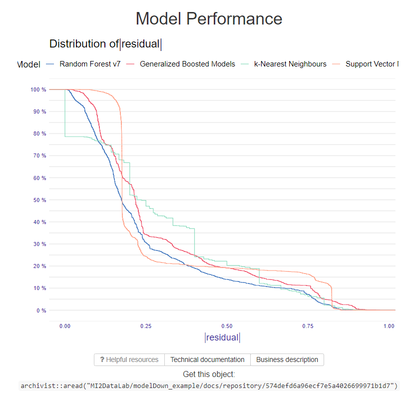
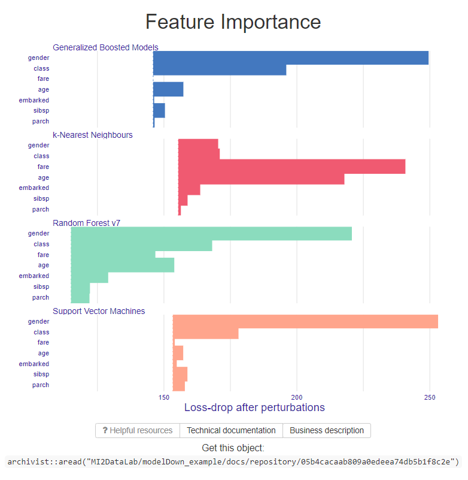
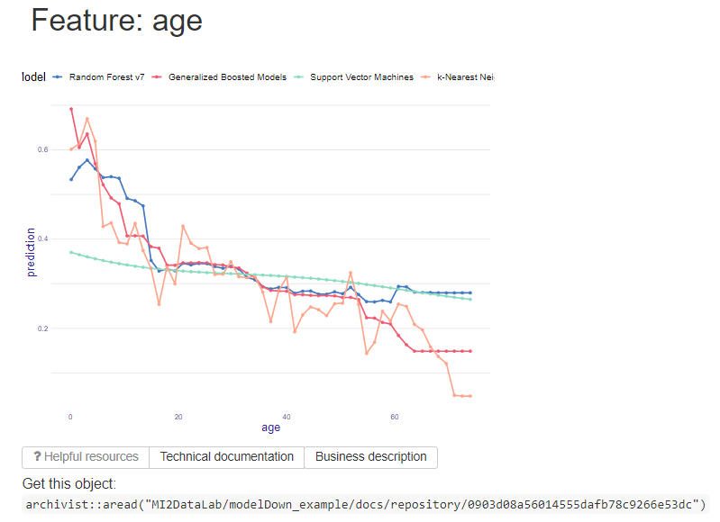

# modelDown

`modelDown` generates a website with HTML summaries for predictive models.
Is uses [DALEX](https://github.com/ModelOriented/DALEX) explainers to compute and plot summaries of how given models behave.  We can see how well models behave (Model Performance, Auditor), how much each variable contributes to predictions (Variable Response) and which variables are the most important for a given model (Variable Importance). We can also compare Concept Drift for pairs of models (Drifter). Additionally, data available on the website can be easily recreated in current R session (using the `archivist` package).

`pkgdown` documentation: https://ModelOriented.github.io/modelDown/

An example website for regression models: https://mi2datalab.github.io/modelDown_example/

## Getting started

Do you want to start right now ? Check out our [getting started](https://ModelOriented.github.io/modelDown/paper) guide.

Or just simply install it like below:

Stable version: `devtools::install_github("ModelOriented/modelDown")`

And if you want to get the latest changes:

Development version: `devtools::install_github("ModelOriented/modelDown@dev")`

## Contributing

If you spot a bug or you have a feature proposal feel free to create an issue in this repository. We are also open to contributions in a form of pull requests. Just follow steps below:

1. Open a new issue (specify an issue type as a label - a bug or an enhancement).

Additionally you can:

2. Start a new branch from the `dev` branch. It should be named `bugfix/XX-short-description` or `feature/XX-short-description` where `XX` is an issue number.
3. Create commits with descriptive messages starting with `#XX`.
4. Create a pull request of the created branch to the `dev` branch.
5. Wait for a review from one of the `modelDown` maintainers.

Help us build better software!

## Index page

Index page presents basic information about data provided in explainers. You can also see types of all explainers given as parameters. Additionally, summary statistics are available for numerical variables. For categorical variables, tables with frequencies of factor levels are presented.

## Auditor

Module shows plots generated by `auditor` package. 

## Drifter

Results of `drifter` package are displayed in this tab. In order to see the comparison charts, you have to provide pair of explainers as parameters (for example: `list(explainer_glm_old, explainer_glm_new)`).

## Model Performance

Module shows result of function `model_performance`. 

## Variable Importance

Output of function `variable_importance` is presented in form of a plot as well as a table.

## Variable Response

For each variable, plot is created by using function `variable_response`. Plots can be easily navigated using links on the left side. One can provide names of variables to include in the module with argument `vr.vars` (if argument is not used, plots for all variables of first explainer are generated).

## Loading data in R

In each tab you can find links with R commands. If you execute them, you can load relevant objects into current R session (`archivist` package is necessary). By default data is stored and loaded from local repository. If you wish to store data on GitHub repository, please provide argument `remote_repository_path`. After generating modelDown website, `repository` folder must be placed under this path.

## Acknowledgments 

Work on this package is financially supported by Warsaw University of Technology, Faculty of Mathematics and Information Science.
