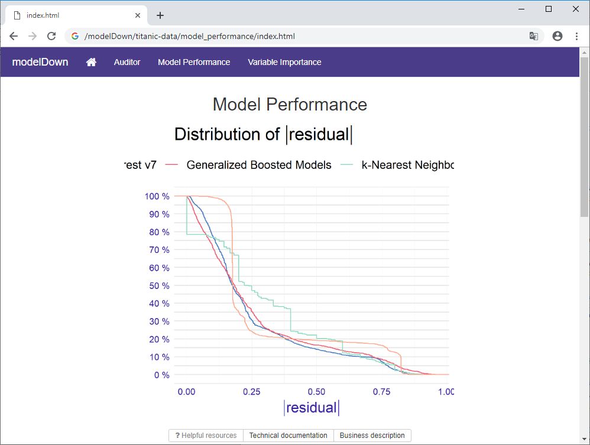
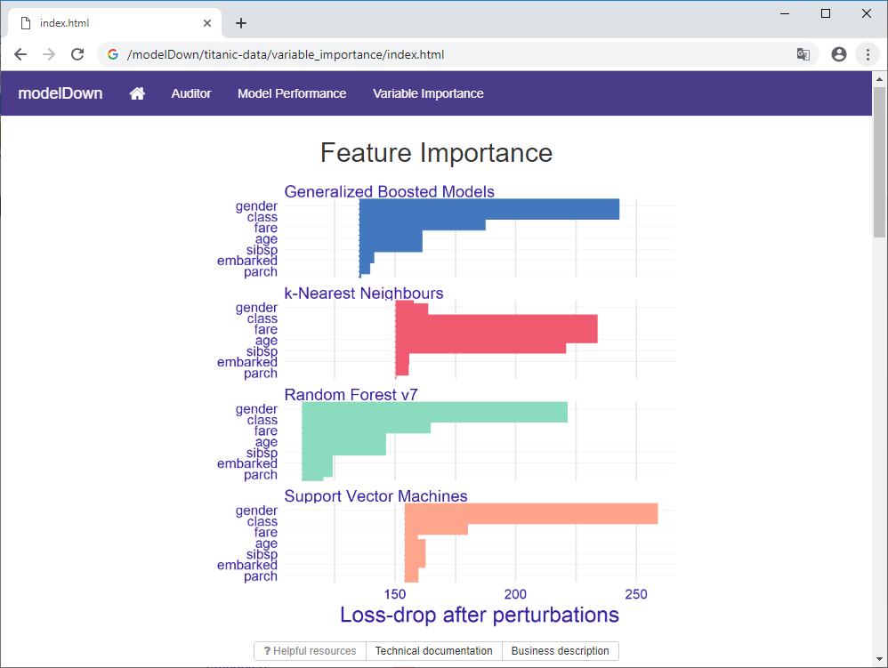

# Introduction

We live in times where machine learning is used almost everywhere. With the amount of accessible tools available, generation of predictive model for your own benefit is fairly straightforward. 

The models may be simple to create and use, but most of the time they are not simple to understand. Larger models may contain thousands or millions of parameters. It can be challenging to see how the model works and how the inputs impacts obtained results. Numerous tools for explainable Artificial Intelligence can help with that, but it may be cumbersome and repetitive to use different tools every time you test the model. 

In this paper, we introduce a package modelDown for the R language [@R] that can help to eliminate these issues. It automatically creates an easy to understand HTML website with model interpretations. You can automatically analyze, explore and debug your predictive models in many ways with just a single command.

The modelDown package is designed in a similar way to the pkgdown [@pkgdown] library. Both packages use templates to generate a static HTML website with detailed information. In the case of pkgdown it is an information about a selected package, while in the case of modelDown it is a website with information about predictive models.

The modelDown package builds on the set of tools for model exploration implemented in the DALEX [@DALEX] package. By creating explainer objects, DALEX provides uniform interface for model agnostic exploration of models. Other R packages compatible with DALEX are also used to provide data, tables and charts available on the website.

# Example code

A basic example of using the package is as straightforward as below.

```
require("ranger")
require("breakDown")
require("DALEX")

devtools::install_github("MI2DataLab/modelDown")

# ranger
HR_ranger_model <- ranger(as.factor(left) ~ .,
                          data = HR_data, num.trees = 500,
                          classification = TRUE, probability = TRUE)

# glm
HR_data1 <- HR_data[1:4000,]
HR_data2 <- HR_data[4000:nrow(HR_data),]
HR_glm_model1 <- glm(left~., HR_data1, family = "binomial")
HR_glm_model2 <- glm(left~., HR_data2, family = "binomial")

# generating explainers
explainer_ranger <- explain(HR_ranger_model,
                            data = HR_data, y = HR_data$left,
                            function(model, data) {
                              return(predict(model, data)$prediction[,2])
                            }, na.rm=TRUE)
explainer_glm1 <- explain(HR_glm_model1, data=HR_data1, y = HR_data1$left)
explainer_glm2 <- explain(HR_glm_model2, data=HR_data2, y = HR_data2$left)

modelDown::modelDown(explainer_ranger, list(explainer_glm1, explainer_glm2))
```

# Available features

The modelDown package is highly modular. The primary outcome is a website with a set of tabs. Each tab explains a particular aspect of the model. Features are available across the tabs. By default, all the tabs are generated, and each of them can be parameterized. 

The 'Auditor' tab presents different ways of validating predictive models by analysis of residuals. All plots are generated by the auditor package [@Auditor]. The plots may seem a bit complicated at first sight, so each plot has links with helpful explanations. 

The 'Model performance' tab uses functions from DALEX package [@DALEX]. It shows contrastive comparisons of model predictive power by analyzing residuals. Read more about this type of model diagnostic in [@PM_VEE].

The 'Model performance' tab lets you compare different models. The same applies for all tabs created with modelDown. This allows users not only to validate one model, but to pick the best model among many. Below we can see different distributions of residuals for the models.

-

The 'Feature importance' tab also uses functions from DALEX package. It shows how much impact each variable has when it comes to generating predictions. You can compare these model agnostic feature importance scores against the domain knowledge in order to see if the model works in the expected way.

-

All examples presented in this paper are based on models generated with the Titanic dataset. In this example, three considered models picked gender as the most important variable. Only k-Nearest Neighbors algorithm picked different features. It may suggest that this model does not give the best results for this data.

The 'Feature response' tab also uses functions from DALEX package. The main goal of this table is to present the link between average model response and the feature of interest. With the use of Partial Dependency Plots or Factor Merger Plots one can read how model predictions change with a changing value of a selected single variable.

Last tab, the 'drifter' uses functions from an R package with the same name [@Drifter]. You can test if there is concept drift or data drift in the data. Also, you can see how changes in the data distribution impact the model of interest.

All of that can be generated using one simple command, which is highly customizable. You can select different plot formats - either a raster png or vectorized [@svg], change each tab's individual settings and control visual aspects.  

To boost reproducibility of models, all results from model exploration and explanation are saved in binary form with the archivist [@Archivist] package. You can always look at them later, share models or explainers with collaborators, validate session info recorded when explainers were created or reproduce selected explainers.

# Summary

The package uses whisker html templates [@whisker]. Also DALEX itself uses the extensible grammar of data visualization implemented in the ggplot2 package [@ggplot2]. Because of that, as new packages compatible with DALEX explainers are developed, modelDown can be extended to use them. The modelDown, with its simple usage and wide variety of information on the models, may be a powerful tool that helps you improve your model predictive power.

See an example website generated with the modelDown package at https://github.com/MI2DataLab/modelDown_example. It also contains a reproducible R code for model training, wrapping and transforming into an HTML website.

The modelDown is a part of DrWhy.AI [@DrWhy] collection of tools for automated training, exploration and maintenance for predictive models.

# Acknowledgments

Work on this package was financially supported by the NCN Opus grant<br/>  
2017/27/B/ST6/01307 at Warsaw University of Technology, Faculty of Mathematics and Information Science.

# References


